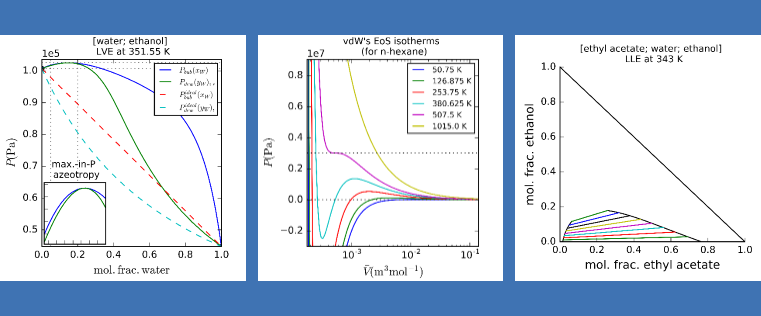
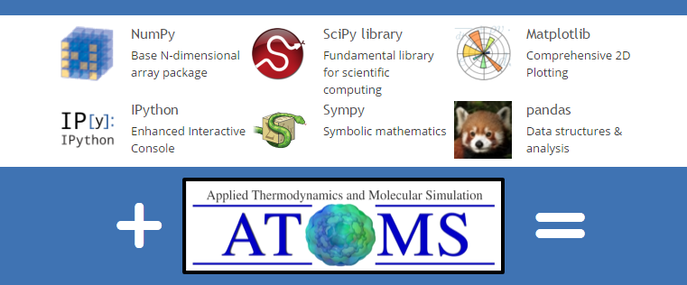

# About the project

* Develop and publish open source computational course materials for students of Applied Thermodynamics and make them widely available.

* Host a virtual laboratory for analysis, development and testing of models and algorithms

* Provide support for the development of research and engineering level packages to fill gaps in the scientific literature of the open source community.

## Scientific computing

* We build our computations on top of the *SciPy* stack -- a Python-based ecosystem of open-source software for mathematics, science, and engineering.

## Development platform

* We build our content in the *jupyter-notebook* format, using the *anaconda* accessible distribution of the SciPy stack,  fow windows, osx and linux.

* We are able to launch our content in web readable format using jupyter's *nbviewer*, GitHub's *gh-pages* and compatible *Jekyll* theme.

* We make our content available to the remote executable environments of *Python Tutor* and *myBinder*.

* We host our whole project on *GitHub*

[Click to read more about the project >>](pages/about.md)

# Read statically

* Reading our material statically in web page format is straightforward from your browser:

[ > Read statically online ](http://nbviewer.jupyter.org/github/{{ site.github.owner_name }}/{{ site.github.repository_name }}/blob/master/index.ipynb)

# Read interactively

 * Our zeroth lectures can run remotely on python tutor live, by Philip Guo. Try them on your browser:

[ >_ Zeroth lectures - Read interactively ](http://nbviewer.jupyter.org/github/{{ site.github.owner_name }}/{{ site.github.repository_name }}/blob/master/contents/zeroth-lectures/zeroth-lectures.ipynb)

 * Our main lectures can run remotely on myBinder. Try them on your browser:

[< ! > Check the system status](http://mybinder.org/status)

[ >_ Main lectures - Read interactively](http://mybinder.org:/repo/{{ site.github.owner_name }}/{{ site.github.repository_name }})

# Setup locally

* Download our whole content package, either as zip or as tar.

[< ZIP > Download](http://github.com/{{ site.github.owner_name }}/{{ site.github.repository_name }}/zipball/master)

[< TAR >  Download](http://github.com/{{ site.github.owner_name }}/{{ site.github.repository_name }}/tarball/master)

* To run locally and develop on top of our content, we recommend setting up Python and the SciPy stack using the anaconda distribution.

[Click to read more about setting up locally >>](pages/setup.md)

# Get involved

* Ours is an open source project in early development stage. In order to get involved, either reach out via e-mail, or sign up on GitHub and use their collaborative work tools.

[Click to read more about getting involved >>](pages/getinvolved.md)

# Acknowledgements

* This work is currently being developed in [ATOMS][ATOMS-site] - the *laboratory of applied thermodynamics and molecular simulation* of UFRJ, Brazil.

[ATOMS-site]: http://atoms.peq.coppe.ufrj.br

* We would like to acknowledge the platform tools that make this work possible and also some prior and concurrent work that inspire us.

[Click to read on >>](pages/acknowledgements.md)

---

 
